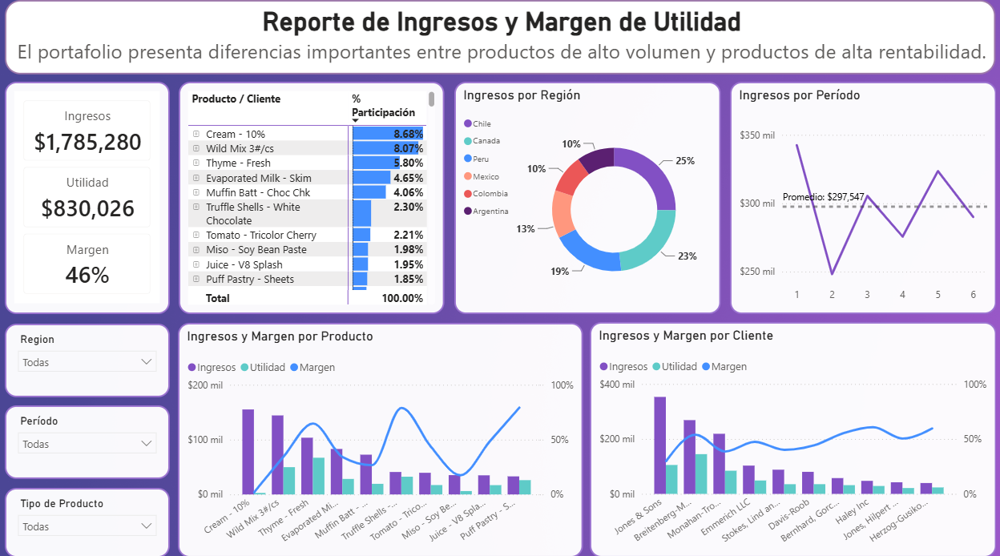

# Regional Sales & Profitability Analysis

## Project Overview

This Power BI project analyzes the commercial performance of a multi-region product portfolio, focusing on **revenue, profitability, customer concentration, product performance, regional distribution, and sales trends over time**.

The objective is to identify opportunities to improve profitability, reduce commercial concentration risk, and prioritize products and markets with greater growth potential.

---

## Business Questions

The analysis focuses on answering the following questions:

* Which products generate the highest revenue?
* Which products generate the highest profit margins?
* Are high-revenue products also highly profitable?
* Which customers represent the greatest concentration risk?
* How diversified are product sales across customers and regions?
* Which regions generate the largest share of revenue?
* Are revenues growing consistently over time?
* Where are the strongest opportunities to improve profitability or increase sales volume?

---

## Dashboard



The dashboard combines revenue, profit, and margin indicators with interactive filters by:

* Region
* Period
* Product type

It also allows analysis at product, customer, region, and time-period levels.

---

## Key Performance Indicators

The portfolio generated approximately:

* **Revenue:** $1.79M
* **Profit:** $830K
* **Overall Margin:** 46%

Although overall profitability is strong, the analysis reveals significant differences between high-volume products and high-margin products.

---

## Key Business Insights

### 1. High concentration between Cream - 10% and Jones & Sons

**Context:**
Cream - 10% is the highest-revenue product in the portfolio, generating approximately **$155K and 8.68% of total revenue**.

**Finding:**
100% of Cream - 10% sales come from **Jones & Sons**, while this product represents approximately 44% of that customer's total purchases.

**Implication:**
This creates a significant product-customer concentration risk. Expanding Cream - 10% to additional customers or regions could reduce dependence on a single account and strengthen revenue stability.

---

### 2. Cream - 10% generates high revenue but minimal profitability

**Context:**
Cream - 10% leads the portfolio in revenue.

**Finding:**
Despite its strong sales volume, the product generates a margin of approximately **2%**, substantially below the portfolio average.

**Implication:**
The priority should be improving profitability rather than increasing sales volume. Cost drivers such as transportation, purchasing, storage, discounts, losses, and commercial conditions should be reviewed.

Because of its high volume, even a moderate margin improvement could produce a meaningful increase in total profit.

---

### 3. Wild Mix presents a more diversified commercial structure

**Context:**
Wild Mix 3#/cs is the second-largest product by revenue, generating approximately **$144K and 8.07% of total revenue**.

**Finding:**
Unlike Cream - 10%, Wild Mix sales are distributed across multiple customers and regions.

**Implication:**
This diversified structure reduces concentration risk. The commercial strategy behind Wild Mix could be analyzed and potentially replicated across other high-revenue products.

---

### 4. High-margin products represent a growth opportunity

**Context:**
Products such as **Truffle Shells** and **Puff Pastry - Sheets** generate margins significantly above the overall portfolio margin.

**Finding:**
Despite their strong profitability, their revenue contribution remains relatively low compared with leading products.

**Implication:**
These products represent an opportunity to increase sales while preserving current margins.

Potential actions include:

* Expanding regional coverage
* Acquiring new customers
* Increasing purchase frequency
* Increasing average order volume
* Cross-selling to existing customers

---

### 5. Revenue fluctuates considerably across periods

**Context:**
Average revenue per period is approximately **$297.5K**.

**Finding:**
Revenue fluctuates significantly between periods. Period 2 falls to approximately $250K, while periods 1 and 5 exceed $320K.

There is no clear sustained growth trend.

**Implication:**
Lower-performing periods should be analyzed by product, customer, and region to determine whether changes are driven by seasonality, temporary demand reductions, or specific commercial factors.

---

### 6. Revenue is concentrated in the largest regions

**Context:**
Sales are distributed across six regions.

**Finding:**

* Chile represents approximately **25%** of revenue.
* Canada contributes approximately **23%**.
* Peru contributes approximately **19%**.

Chile and Canada therefore account for almost **48% of total revenue**.

**Implication:**
These markets should continue to be protected and developed, while lower-participation regions could be targeted for expansion, particularly using high-margin products.

---

## Executive Insight

The portfolio presents two complementary opportunities:

**Improve profitability where sales volume is already high, while increasing volume where profitability is already strong.**

At the same time, reducing dependency on individual customers, products, and regions can strengthen the resilience of the commercial portfolio.

---

## Tools & Technologies

* Power BI
* Power Query
* DAX
* Excel
* Data Modeling
* Data Visualization

---

## Skills Demonstrated

This project demonstrates practical experience in:

* Business Intelligence
* KPI development
* Revenue analysis
* Profitability analysis
* Margin analysis
* Customer segmentation
* Product performance analysis
* Regional sales analysis
* Trend analysis
* Interactive dashboard development
* DAX calculations
* Business insight generation
* Data-driven recommendations

---

## Repository Structure

```text
regional-sales-powerbi-analysis/
├── README.md
├── regional_sales_analysis.pbix
└── sales_profitability_dashboard.png
```

---

## Conclusion

The analysis shows that high revenue does not necessarily translate into high profitability.

The strongest commercial opportunities come from balancing two strategies:

1. **Improve margins in products that already generate significant revenue.**
2. **Increase sales volume for products that already generate strong margins.**

The results also highlight the importance of diversifying customers and regional revenue sources to reduce concentration risk and improve long-term commercial stability.
